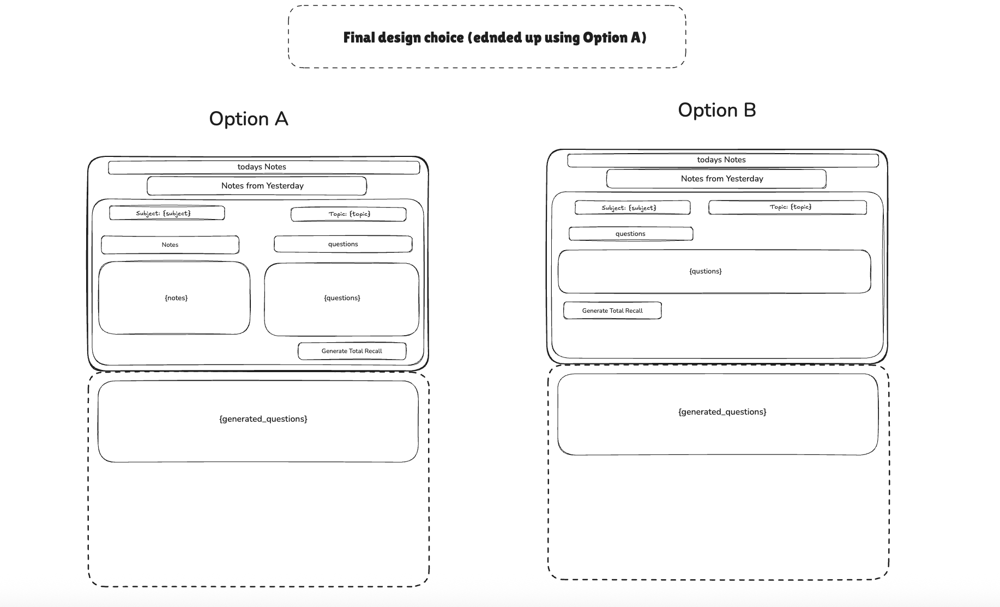
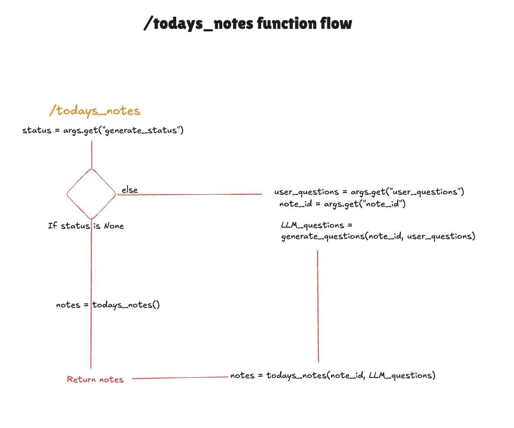

# ISE-entrence-submission-2026

I recommend opening external links with google chrome where possible as the links contain bookmarks which safarai does not always load correctly. 

Name: Rian O’Leary  
Contact: [rianoleary@gmail.com](mailto:rianoleary@gmail.com)  
Exam number: 380870  
CAO number: 26492236

The project I am submitting is a study tool for students that I have called Total Recall. It leverages the scientific “best” way to study ([the right time to learn](https://pmc.ncbi.nlm.nih.gov/articles/PMC5126970/?)), by turning the research of active recall and spaced learning into a practical tool for students (i.e myself) so that students can get the most out of their time when learning.

It was as part of the TECS competition over a four week time frame. The project has not been altered since it was originally built. Please see demo video [https://www.loom.com/share/934d09dc380445baae8828920e0e5f34](https://www.loom.com/share/934d09dc380445baae8828920e0e5f34)

**Problem Identification:**

I built this project for two reasons:

1. To build a study tool for myself based on the scientific study “the right time to learn” after I could not find a tool online that did so already.  
     
2. Learn to code \- specifically in python and learn web frameworks (Flask), LLM APIs and databases.

**Scope definition:**

Due to the 4 week constraint and limited skillset, the scope could only include the following

1. Clean UI to input and view notes [\[1\]](#1)  
2. Dynamic question generation using LLMs  
3. Integration into Supabase as basic database

Out of scope was 

1. Daily cron for emailing notes  
2. Mobile optimization [\[4\]](#4)  
3. Ability to edit notes after submission  
4. Original note viewing design [\[2\]](#2)

I designed Total Recall using [Excalidraw](https://excalidraw.com/). I sketched designs on the architecture and UI for clarity on the Tool’s functionality and use case. Design sketches were completed before I started building which defined how the tool would look.

**Tech Stack:**

* Frontend \- HTML  with JINJA templating, JS  
* Backend \- Python, Postgres SQL hosted on Supabase, Flask for web framework  
* LLM \- Gemini-2.5-flash

**Milestones:**

* [Week 1](https://github.com/99rebels/total-recall/blob/main/docs/week-one.md): learn Python, Flask and databases. Create UI designs  
* [Week 2](https://github.com/99rebels/total-recall/blob/main/docs/week_two.md): systems design [\[0\]](#0), create MVP connecting to DB  
* [Week 3:](https://github.com/99rebels/total-recall/blob/main/docs/week_three.md) learn JS for user question input, LLM integration for dynamic question generation  
* [Week 4:](https://github.com/99rebels/total-recall/blob/main/docs/week_four.md) Style using tailwind CSS and ship to production (render.com)

**Problem solving:**  
Friction log spanning four weeks: [https://github.com/99rebels/total-recall/blob/main/docs/friction-log.md](https://github.com/99rebels/total-recall/blob/main/docs/friction-log.md)

* Switched from flatfile DB to a relational DB during \[[link](https://github.com/99rebels/total-recall/blob/main/docs/friction-log.md#900:~:text=I%20also%20need%20to%20change%20my%20databse%20table%20from%20a%20flat%20file%20DB%20to%20a%20relational%20one%2C%20using%20foreign/local%20keys%2C%20etc.)\]  
* Started with returning raw HTML from the server. Changed to Jinja templating for cleaner code \[[link](https://github.com/99rebels/total-recall/blob/main/docs/friction-log.md#1515:~:text=I%20have%20come%20to%20the%20conluction%20that%20jinga%20templating%20is%20the%20way%20to%20go.%20It%20isn%27t%20actually%20as%20complicated%20as%20I%20though%20and%20trying%20to%20build%20the%20html%20pages%20up%20through%20Python%20is%20already%20complicated%20with%20a%20simple%20form%20page.)\]  
* Switched feature priority. Chose LLM integration over daily email cron \[[link](https://github.com/99rebels/total-recall/blob/main/docs/friction-log.md#1430:~:text=I%27ve%20also%20decided%20not%20to%20prioratise%20the%20daily%20email.%20Instead%20I%20want%20to%20intergrate%20AI%20in%20total%20recall%20\(because%20I%27ve%20wanted%20to%20work%20with%20LLM%27s%20for%20ages%20and%20I%20think%20it%20would%20be%20so%20cool\).)\]  
* Started out with an initial design using a dynamic view pane resizer [\[2\]](#2). but reduced the scope due to time constraints and lack of JS knowledge [\[3\]](#3).  
* Switched to Tailwind CSS over raw CSS \[[link](https://github.com/99rebels/total-recall/blob/main/docs/friction-log.md#301125:~:text=Styling%20was%20much%20easier%20than%20I%20first%20thought%20with%20tailwind.%20I%20started%20off%20with%20the%20bear%20bones%20of%20styling%20\(rows%20and%20Columns\)%20and%20then%20applied%20some%20basic%20styling%20to%20primary%20buttons%2C%20text%20areas%20etc.)\]

**Testing \+ Validation:**

* Tested various LLM’s and found Gemini-2.5-flash gave best speed to quality (and cheap)  
* Getting user feedback (friends). Nailed down final UI designs.

**Learnings:**

* Don’t commit .env files to github \[[link](https://github.com/99rebels/total-recall/blob/main/docs/friction-log.md#1430:~:text=I%20have%20realised%20that%20I%20have%20been%20including%20my%20.env%20file%20in%20my%20github%20pushes%20\(fine%20for%20now%20but%20could%20have%20been%20really%20bad%20if%20I%20had%20my%20private%20DB%20key%20or%20AI%20API%20key\).%20So%20I%20need%20to%20sort%20that%20out.)\]  
* Develop more flowcharts to help understand and solve logic problems (like [\[5\]](#5))  
* Comment my code more during development \[[link](https://github.com/99rebels/total-recall/blob/main/docs/friction-log.md#1940:~:text=After%20trying%20to,on%20the%20date.)\]

**Most proud of:**

* I didn't do computer science in 5th year and used TECS as a way to learn python, Flask and system design.  
* Integrating with LLM’s was incredibly interesting. It was a stretch goal and I’m proud to have gotten to it in the end. It added huge value to the tool. \[[link](https://github.com/99rebels/total-recall/blob/main/docs/friction-log.md#1150:~:text=Holy%20shit%2C%20after,button%20is%20pressed.)\]  
* The end product is consistent with designs created in week 1\.

**Improvements:**

* Set up user management to allow others to create an account and have their own note storage  
* have the ability to edit notes once they’re submitted by the user  
* set up a daily cron to send an email to the user with their notes.

**Other projects to note:**

* [Leaving cert project:](https://github.com/99rebels/leaving-cert-project/blob/main/README.md) An early warning forest fire detection tool making use of a [Weather API](https://www.weatherapi.com/) and the users location of their choice to dynamically generate a fire risk for their chosen location.   
    
* [Blog translator:](https://github.com/99rebels/blog-translator/tree/main) An AI translation tool (built with claude code) to translate entire blogs for writers that keeps HTML structure and optimises SEO ranking in the translated language and targeted countries.

* [Main](https://github.com/99rebels?tab=repositories) Github repo: contains a total of 14 repos \- 9 are websites I built (with AI) and attempted to sell by cold calling business owners after I built the site. It didn’t work whatsoever…

### \[0\]
#### Sequence diagram of system architecture  

### \[1\]
#### Note input page
 (this was the original design which is consistent with the current page in Total Recall)  
  
 

 

### \[2\] 
#### Original design plans for the Note viewing page
  
 

 

### \[3\]
#### The final note viewing page consitent with the current build
 

 

 

### \[4\]
#### mobile optimization UI (I never got around to this but my designs for what it might have looked like are below)

 

 

### \[5\]
#### Flow chart for the function “todays\_notes”

